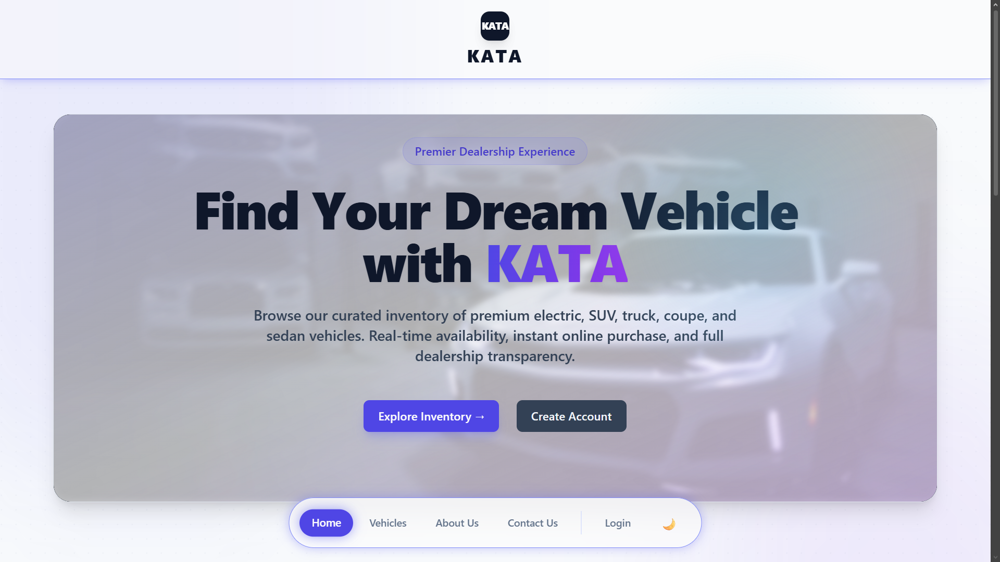
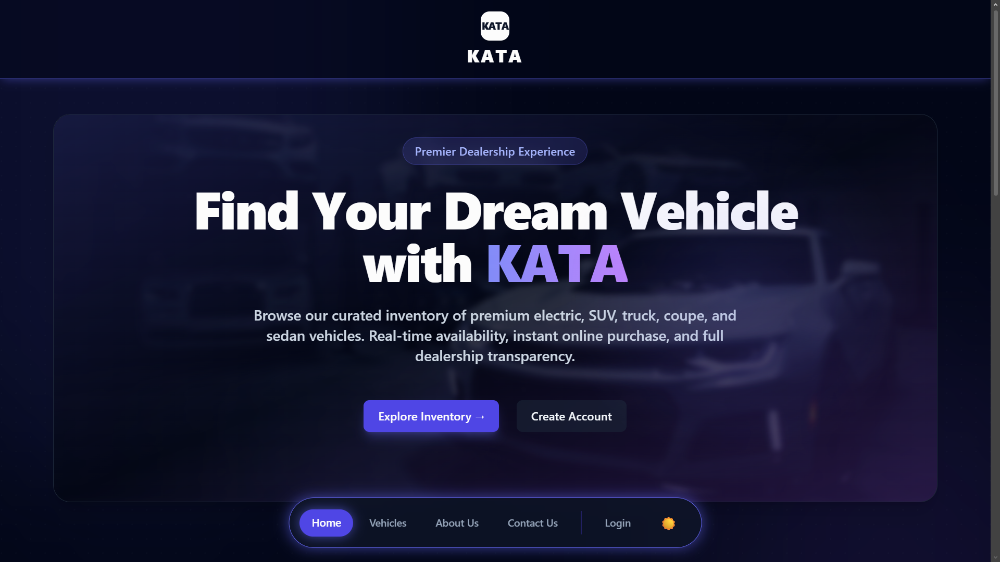
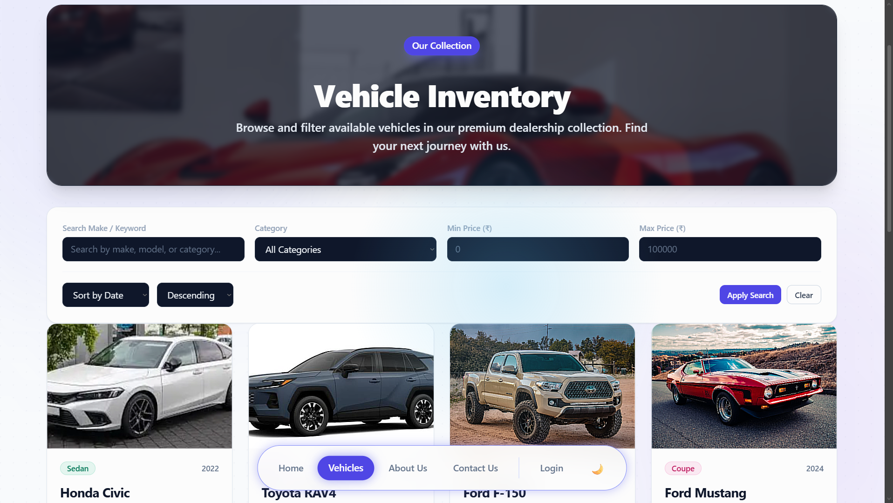
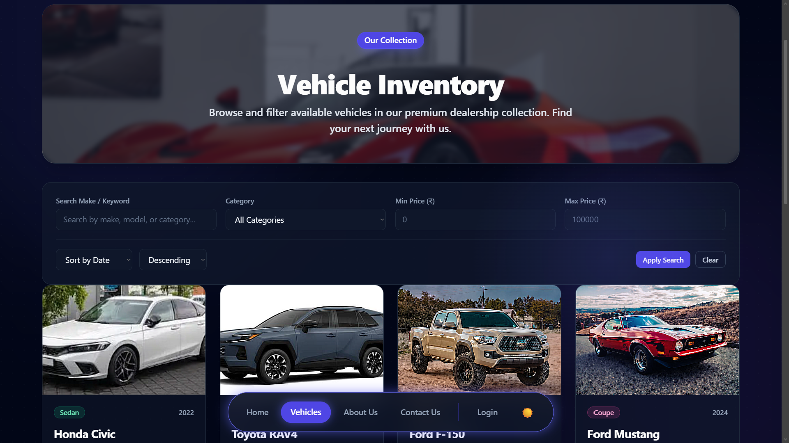
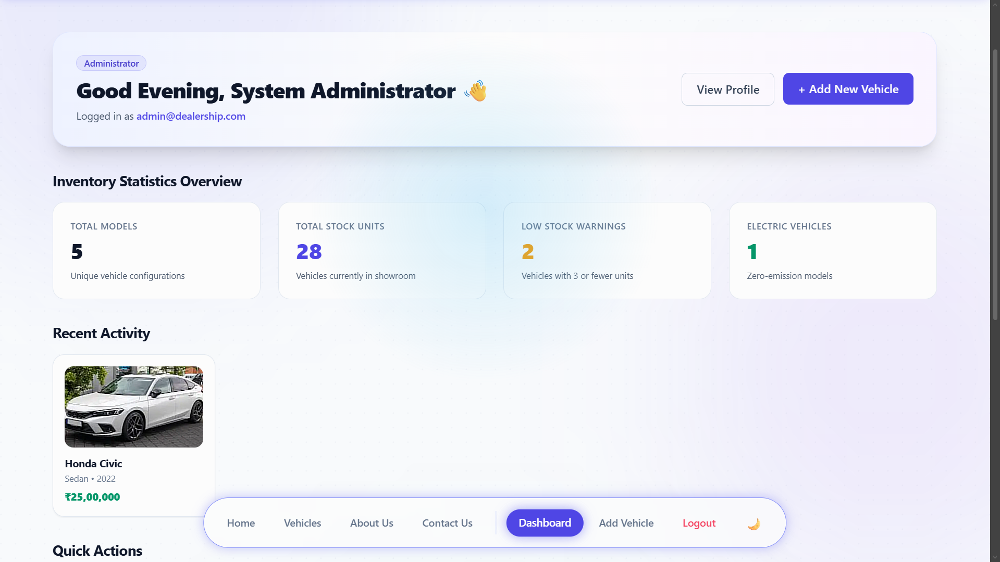
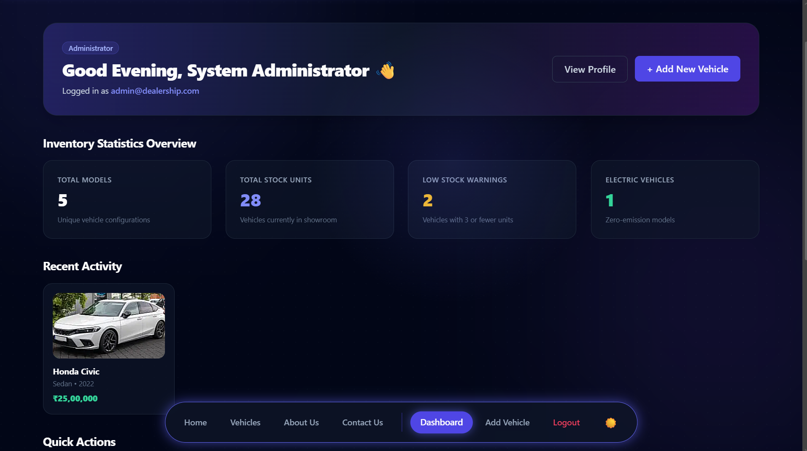

# Car Dealership Inventory System

A premium, full-stack vehicle inventory and administration management platform. Designed with glassmorphic modern aesthetics, robust state handling, strict authorization gating, and an extensive test coverage suite.

## Features

- **Dynamic Theme Management**: Vibrant Light and Dark modes with custom cursor glow effects and neon highlights.
- **Role-Based Controls**: Distinct dashboards and operations for standard customers and staff (Users) vs managers (Admins).
- **Vehicle Checkout/Purchase**: Real-time inventory deduction and checks to prevent double-checkout or oversell scenarios.
- **RESTful API**: Comprehensive JSON endpoints for vehicles (CRUD, search, pagination, restock, purchase) and auth (registration, login, token rotation).
- **Auto-Refresh & Security**: JWT access/refresh token rotation with global redirect gates to cleanly log out users when sessions expire.
- **Full Test Suite**: 91 unit and integration tests verifying controllers, schemas, route protections, form components, and database models.

---

## UI Showcase

Here is a side-by-side comparison of the Light and Dark themes across key pages of the system:

<table width="100%">
  <thead>
    <tr>
      <th align="center" width="50%">☀️ Light Theme</th>
      <th align="center" width="50%">🌙 Dark Theme</th>
    </tr>
  </thead>
  <tbody>
    <tr>
      <td colspan="2" align="center"><b>Home Page</b></td>
    </tr>
    <tr>
      <td></td>
      <td></td>
    </tr>
    <tr>
      <td colspan="2" align="center"><b>Vehicles Catalog</b></td>
    </tr>
    <tr>
      <td></td>
      <td></td>
    </tr>
    <tr>
      <td colspan="2" align="center"><b>Admin Dashboard</b></td>
    </tr>
    <tr>
      <td></td>
      <td></td>
    </tr>
  </tbody>
</table>

---

## Technical Stack

### Backend
- **Node.js & Express** (TypeScript)
- **Prisma ORM** with **PostgreSQL**
- **Zod** (Schema validation)
- **Vitest** & **Supertest** (Testing suite)

### Frontend
- **React** (Vite + TypeScript)
- **React Router Dom** (Gated routing)
- **TailwindCSS** (Custom typography and glassmorphic designs)
- **Sonner** (Toast notifications)

---

## My AI Usage

This project was thoroughly "vibecoded" using a multi-AI collaborative framework where the developer coordinated distinct tasks across specialized AI tools.

### 1. Extent of AI Code Contribution
- **AI Contribution**: **~95%** of the lines of code in the repository were written, refactored, or optimized by AI models.
- **Human Contribution**: **~5%** representing the high-level configuration directives, structural layout decisions, authentication checks, custom testing guidelines, code reviews, and final bug triage alignments.

### 2. Tool Workflow & Roles
- **Prompt Generator**: **ChatGPT (OpenAI)** was used to brainstorm structures, outline logic criteria, decide the tech stacks, and generate all prompt files utilized during coding.
- **Code Execution Agent**: **Antigravity (Google DeepMind's agentic coding assistant)** executed all workspace edits, generated the actual code, fixed bugs, ran test completions, and handled **README.md** file generation.
- **Documentation Compiler**: **Claude Opus (Anthropic)** compiled structural reference sheets, reviewed layout changes, and generated the general setup documentation (`setup.md`).

---

### 3. Chronological Development Phases Completed

We successfully completed **10 out of the 12 planning phases** for this project:

#### 📂 Phase 1: Project Initialization
- Set up frontend and backend project templates.
- Configured ESLint rules, Prettier styles, TypeScript compilation options (`tsconfig.json`), and Tailwind CSS variables.
- Created Git repositories, created local environment templates (`.env.example`), and established base layout frameworks.

#### ⚙️ Phase 2: Backend Foundation
- Scaffolded Express server configs and routing layers.
- Integrated Zod schema validator middleware, custom application error boundaries (`AppError`), and global error handling routes.
- Configured logging middleware and database environment configurations.

#### 🗄️ Phase 3: Database Design
- Modeled the relational PostgreSQL database schema definitions with Prisma ORM.
- Applied migrations (`npx prisma migrate dev`) to compile relational User and Vehicle tables.
- Authored seed scripts (`prisma/seed.ts`) to populate mock administrator and customer credentials alongside starter vehicle stock.

#### 🔑 Phase 4: Authentication & Authorization
- Built standard user registration (`POST /api/auth/register`) and session login (`POST /api/auth/login`) endpoints.
- Implemented BCrypt password encryption, JWT access/refresh token signing, token rotation APIs, and role-based access controllers (blocking USER roles from ADMIN routes).

#### 🚗 Phase 5: Core Features
- Implemented full CRUD controllers for vehicles (adding, modifying, viewing, searching, and deleting records).
- Coded the vehicle purchase transaction route (`POST /api/vehicles/:id/purchase`) with strict stock checks, and the restock handler (`POST /api/vehicles/:id/restock`).
- Added multi-filter keywords search, sorting, and pagination logic to database queries.

#### 📦 Phase 6: Frontend Foundation
- Established page routers (`AppRouter`) gated behind `ProtectedRoute` and `PublicRoute` wrappers.
- Integrated `Axios` clients (`apiClient.ts`) carrying automated authorization headers and interceptors to parse errors.
- Built reusable UI framework blocks (buttons, badging labels, selects, inputs, forms, and spinners).

#### 🎨 Phase 7: Frontend Features
- Created Home, Dashboard, Profile Management, Vehicle Browsing, Vehicle Details, Login, and Register pages.
- Standardized dynamic layouts (`MainLayout`, `DashboardLayout`, `AuthLayout`) incorporating themes toggling (Light/Dark Mode).
- Implemented automated global listeners to sign out users on session expirations.

#### 🧪 Phase 8: Testing
- Developed backend test coverage using Vitest and Supertest (testing JWT signing, password utilities, error route statuses, and middleware validators).
- Created frontend unit and integration tests using Vitest and React Testing Library verifying layouts and profile actions.

#### ⚡ Phase 9: Optimization
- Optimized the backend Vitest suite by removing slow database seeds from individual test file `afterAll` teardowns, triggering database seeds exactly once post-run.
- Refactored `MainLayout.tsx` and `Dashboard.tsx` grids to dynamically justify Quick Action columns based on user role (4 columns for users, 5 columns for admins).
- Overrode dark mode CSS variables to prevent CTA link text from becoming unreadable.

#### 🌐 Phase 10: Deployment & Production Readiness
- Created environment-specific configuration schemas using Zod for backend env validation.
- Configured dynamic CORS setup via `FRONTEND_URL` and API routing using `VITE_API_URL`.
- Implemented root level database-aware `/health` monitoring endpoints.
- Configured HTTP security headers and graceful process shutdown handlers (`SIGTERM`, `SIGINT`).
- Added package script utilities for automated prisma generation, dev migrations, and seeding.
- Verified compilation builds and 100% test coverage passing sequentially for production readiness.

---

### 4. Developer Reflections
The combination of ChatGPT for prompt generation, Antigravity for agentic workspace coding and README generation, and Claude Opus for documentation allowed for rapid full-stack iteration. Writing Zod models, controllers, and Supertest mock scenarios manually would have taken days; the AI generated correct structures in minutes.

The primary engineering challenges lay in identifying and resolving logic discrepancies, handling database connection pools, configuring route wrapper files, and managing TypeScript typing configurations. This project is a clear case study in how full-stack vibecoding, when paired with solid manual code reviews, yields secure, performant, and visually stunning applications.